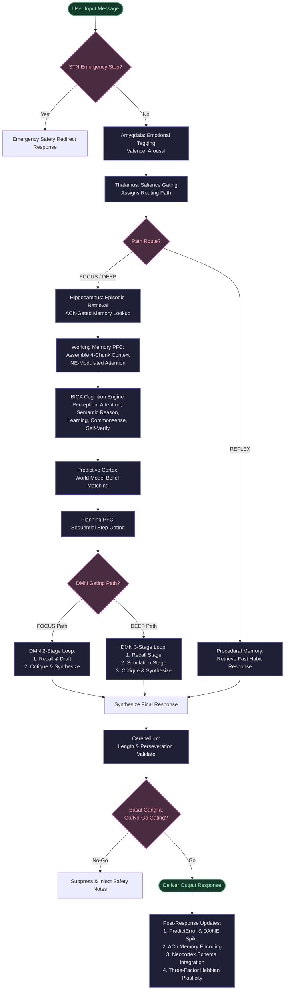

# 🧠 BICA v3 — Biologically-Inspired Cognitive Architecture

> A human-brain-mimicking AI agent that processes every message through **25 live brain modules** — complete with neuromodulators, hippocampal episodic memory, basal ganglia action gating, cerebellar timing, a live brain-topology visualization UI, and online self-training.

[](https://python.org)
[](https://fastapi.tiangolo.com)
[](https://huggingface.co/Qwen/Qwen2.5-0.5B-Instruct)
[](https://github.com/Subrata0Ghosh/Agentic-LLM)
[](LICENSE)

---

## 🚀 Overview: What is BICA v3?

BICA v3 is an agentic AI system where every response is produced by a **biologically faithful pipeline** of simulated brain regions rather than a single LLM call. The architecture models:

- **Thalamus** → gates sensory input by salience (including emotional load)
- **Amygdala** → emotional tagging (valence/arousal) before routing
- **Hippocampus** → ACh-gated episodic memory encoding & retrieval with reconsolidation
- **PFC / Working Memory** → capacity-limited (4-chunk), NE-modulated context assembly
- **Default Mode Network (DMN)** → Dynamic 2-stage/3-stage inner monologue: Recall → Simulate → Critique
- **BICA Cognition** → 10-module cognitive engine (perception, attention, learning, self-verification)
- **Cerebellum** → timing prediction, Jaccard-based perseveration detection, plan smoothing
- **Basal Ganglia** → Go/No-Go action gating with dopamine-modulated Q-learning
- **Neocortex** → semantic knowledge graph with three-factor Hebbian plasticity
- **Metacognition (ACC)** → cognitive load monitoring, frustration detection, auto-sleep
- **Neuromodulators** → Dopamine, Serotonin, Norepinephrine, Acetylcholine decay and spikes
- **Autonomous Dreamer** → background sleep consolidation & model fine-tuning

---

## 🎨 Live Brain Visualization UI

Below is the live BICA web dashboard showing cognitive state monitoring, real-time brain mapping, and DMN execution tracking:

| 1. Live Cognitive Trace & Map | 2. DMN Monologue (RECALL) | 3. Metacognitive Telemetry (STATS) |
| :---: | :---: | :---: |
|  |  |  |

---

## 🧬 Architecture Flowchart: 25-Step Brain Pipeline

The diagram below maps out the sequence of steps and cognitive gating that takes place when processing each prompt:



---

## ✨ Premium Brain Features (Latest Additions)

### 1. 🔄 Interactive Correction Feedback & Immediate Self-Training
BICA now supports **human-in-the-loop online learning**. When the user flags an error (e.g., *"you are wrong"*, *"that is incorrect"*), BICA activates a specialized correction state machine:
* **Feedback Gathering:** Prompts the user to specify what the correct answer should be.
* **Verification Agent:** Queries the web (via DuckDuckGo) to verify the correctness of the user's statement.
* **Online PyTorch Fine-tuning:** If verified (or manually overridden by the user via `"override"`), BICA:
  1. Encodes the fact as a high-priority episodic memory.
  2. Integrates it into the Neocortex schema.
  3. Appends the Q-A pair to `data/ai_corpus_cleaned.txt`.
  4. Triggers `online_finetune(max_iters=25)` to update the model weights in real-time.

### 2. 🎛️ Dynamic DMN Depth & 2-Stage DMN Optimization
To achieve fast response times without sacrificing response quality, the DMN now dynamically adjusts its depth based on Thalamic routing:
* **`FOCUS` Path (Informational/Factual):** BICA bypasses the middle `SIMULATE` stage, executing a fast **2-stage pipeline** (`Recall & Draft` $\rightarrow$ `Critique & Synthesize`). This cuts latency by **33%** while preserving strict self-verification.
* **`DEEP` Path (Complex Reasoning/Math):** BICA runs the full **3-stage pipeline** (`Recall` $\rightarrow$ `Simulate` $\rightarrow$ `Critique`) to ensure comprehensive reflection.
* **DMN History Propagation:** Conversational history (`wm_context`) is now fed into *every* stage of the DMN loop, preventing context drift (e.g., when the user asks follow-up questions like *"want step by step"*).


### 3. 📝 Premium Math Typesetting (KaTeX) & Auto-Close Pipeline
BICA's UI now renders beautiful mathematical equations (such as $x^2$ and $\frac{d}{dx}$) using KaTeX.
* **Markdown + KaTeX Placeholder Pipeline:** To prevent the Markdown compiler (`marked.js`) from mangling LaTeX backslashes (like `\frac` or `\text`), BICA extracts all math blocks (`$$`, `\[`, `\(`, `$`, and `(( math ))`), replaces them with placeholder tokens, runs the Markdown parser, and swaps the compiled KaTeX equations back in.
* **Truncated Equation Recovery:** If a response gets truncated due to token limit constraints, BICA's frontend automatically detects unclosed math delimiters (like `\[` or `\(`) and appends closing tags so KaTeX still compiles the math cleanly.

### 4. 🔀 Three-Factor Hebbian Plasticity Equation
Synaptic plasticity in BICA's semantic memory graph is now governed by the classical biological **three-factor learning rule**:

$$
\Delta W_{ij} = \eta \cdot (\text{DA} \cdot \text{ACh} \cdot \text{NE}) \cdot (r_i \cdot r_j)
$$

* **Dopamine (DA):** Surprise/prediction error signal. Rises on novel feedback.
* **Acetylcholine (ACh):** Learning gate. Controls memory encoding.
* **Norepinephrine (NE):** Alertness/arousal gain. Focuses attention.
Updates are only written if there is high arousal/surprise, preventing semantic memory decay from noise.

---

## 📁 Repository Structure

```
.
├── data/                              # Persistence Layer
│   ├── chroma_db/                     # Vector database (ChromaDB)
│   ├── working_memory.json            # Per-session working memory chunks
│   ├── neuromodulators.json           # Per-session neuromodulator levels (DA, SE, NE, ACh)
│   ├── cognitive_flexibility.json     # ACC error history & strategy modes
│   ├── world_model.json               # Predictive cortex cumulative error & belief states
│   ├── basal_ganglia.json             # Go/No-Go log & Q-value table
│   ├── cerebellum.json                # Timing & perseveration stats
│   ├── neocortex_schema.json          # Neocortical schemas
│   ├── semantic_graph.json            # Semantic graph associations
│   └── chat_memory.json               # Persistent chat histories
│
├── src/
│   ├── api/
│   │   └── api.py                     # FastAPI controller running the 25-step pipeline
│   │
│   ├── brain/                         # 🧠 Simulated Brain Regions
│   │   ├── correction_learning.py     # NEW: Feedback loop & online fine-tuning state machine
│   │   ├── bica_cognition.py          # 10-module cognitive runtime engine
│   │   ├── default_mode.py            # DMN depth-optimized simulation loop
│   │   ├── cerebellum.py              # Timing, Jaccard perseveration, plan smoothing
│   │   ├── basal_ganglia.py           # Go/No-Go safety gating, path competition
│   │   ├── neuromodulators.py         # Dynamic gain controls & decay
│   │   ├── Hebbian.py                 # Concept co-occurrence synaptic plasticity
│   │   ├── hippocampus.py             # Episodic memory storage & reconsolidation
│   │   ├── working_memory.py          # Capacity-limited PFC workspace
│   │   ├── thalamus.py                # Salience gating & emotional routing
│   │   ├── amygdala.py                # Valence/arousal emotional tagger
│   │   └── planning_pfc.py            # DL-PFC step sequencing & goals
│   │
│   └── core/
│       ├── generate.py                # Causal LLM wrapper (Qwen2.5-0.5B)
│       ├── online_train.py            # PyTorch optimizer for online training (strict=False)
│       └── vector_memory.py           # ChromaDB backend client
│
├── static/
│   ├── index.html                     # Live brain visualization UI (BICA v3)
│   ├── ui_chat.png                    # Live Chat UI screenshot
│   ├── ui_monologue.png               # DMN monologue UI screenshot
│   └── ui_stats.png                   # Metacognitive stats UI screenshot
└── tests/
    └── test_correction_learning.py    # Suite verifying online learning & state machine
```

---

## 🛠️ Installation & Setup

### 1. Clone the Repository
```bash
git clone https://github.com/Subrata0Ghosh/Agentic-LLM.git
cd Agentic-LLM
```

### 2. Install Dependencies
Ensure you have Python 3.10+ and install all required frameworks (including PyTorch for online training):
```bash
pip install torch transformers fastapi uvicorn beautifulsoup4 requests \
            chromadb sentence-transformers arxiv ddgs nltk
```

### 3. Download NLTK Data
```python
import nltk
nltk.download('punkt')
```

---

## 💻 Running the Architecture

### Launch the Backend Server
```bash
uvicorn src.api.api:app --reload --port 8000
```

### Access the Web Interface
Open your browser and visit: **`http://localhost:8000/`**
* The live brain topology canvas will load.
* On the first run, BICA will download the Qwen2.5-0.5B weights (~1GB) and configure the local embedding database.

---

## 🔌 API Reference

| Method | Endpoint | Description |
|---|---|---|
| `POST` | `/api/chat` | Main interface — runs full 25-step brain pipeline |
| `POST` | `/api/feedback` | Registers 👍/👎 feedback to adjust BG Q-values |
| `POST` | `/api/sleep` | Triggers offline slow-wave sleep & REM fine-tuning |
| `GET`  | `/api/brain_map/{sid}` | Live brain region + neuromodulator state |
| `GET`  | `/api/cognitive_state/{sid}` | All 10 BICA module states |
| `GET`  | `/api/basal_ganglia/{sid}` | Returns Go/No-Go logs and Q-values |
| `GET`  | `/api/cerebellum/{sid}` | Timing maps and perseveration statistics |
| `GET`  | `/api/brain_stats/{sid}` | Complete cognitive telemetry snapshot |
| `GET`  | `/api/memory_inspector` | Inspects stored episodic topics |

---

## 🧪 Verification & Testing
To run the automated tests verifying the online feedback state machine and training loops:
```bash
python -m unittest tests/test_correction_learning.py
```

---

## 📄 License
This project is licensed under the MIT License — see the `LICENSE` file for details.

---
*Built with 🧠 by Subrata Ghosh — BICA v3, July 2026*
